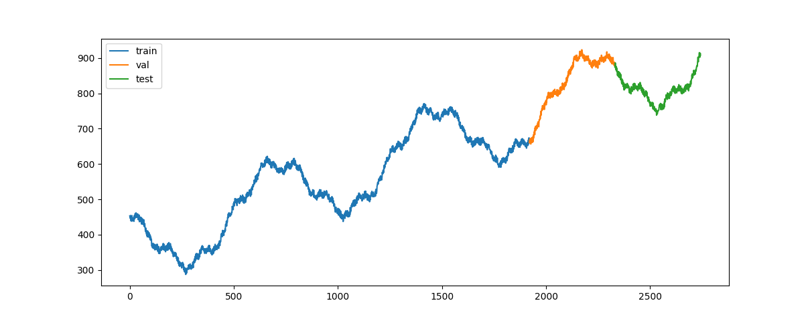

# ts-forecasting-deep-learning
I used this repo for training my self on Time Series Forecasting with PyTorch using the book "Time Series Forecasting using Deep Learning" by Ivan Gridin.

# Notes

## Improving neural networks performance
This is a list of sugestions to improve deep learning architectures:
1. Do not put two same layers in a row
2. Prefer ReLU activation at first
3. Start from fully connected network
4. More layers are better than more neurons
5. Use dropout
6. Put deep learning blocks (e.g. convolution, pooling, padding) in the beginning
